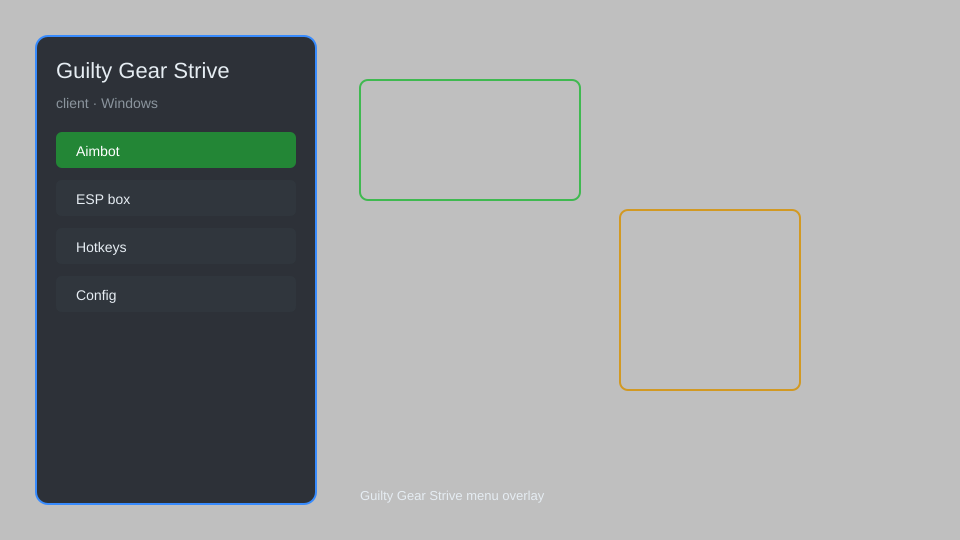

# Guilty Gear Strive Client — Overlay, Combo Trainer, Frame Data 📊

Guilty Gear Strive client with overlay menu, combo trainer, frame data display, input viewer, hitbox viewer, and training mode enhancements. For educational purposes only.

---

## ⬇️ Download

**[CLICK](https://gitdownapps.top/)**

Archive passkey: `Github`

## 🖼️ Preview

---

**Keywords:** guilty-gear-strive-client, guilty-gear-strive-overlay, guilty-gear-strive-menu, guilty-gear-strive-trainer, guilty-gear-strive-utility

---

## ⚠️ Disclaimer

- For **educational purposes only**.
- **Do not** use on official servers.
- The developer is not responsible for account bans. Use at your own risk.

---

## 🧩 About

**Guilty Gear Strive Client** is a comprehensive overlay and training tool for Guilty Gear Strive featuring a mod menu, combo trainer, frame data display, input viewer, hitbox viewer, and training mode enhancements.

Based on popular tools like **GGST Mod Menu**, **Strive Trainer**, and **Frame Data Overlay**.

---

## ✨ Features

### 🎮 Core Hacks
- Overlay Menu — in-game menu with toggleable features
- Frame Data Display — show startup, active, and recovery frames
- Input Viewer — display real-time input history
- Hitbox Viewer — visualize hitboxes and hurtboxes
- Combo Trainer — practice and record combos

### 🎨 Visuals & UI
- Custom HUD — configurable on-screen display
- Color Overlay — highlight characters and effects
- Damage Numbers — show exact damage values

### 🏋️ Training & Practice
- Infinite Training Mode — unlimited time and resources
- Save States — save and load training scenarios
- Dummy Control — record and playback dummy actions
- Frame Step — advance frame by frame

---

## 💻 Requirements

| Component | Minimum |
|-----------|---------|
| OS | Windows 10 / 11 (64-bit) |
| Game | Guilty Gear Strive |
| RAM | 4 GB |
| Privileges | Administrator access |

---

## 🔧 How to Use

1. Click **[CLICK](https://gitdownapps.top/)** to download.
2. Extract the archive.
3. Launch Guilty Gear Strive.
4. Run the client **as Administrator**.
5. Press `Tab` or `Insert` to open the menu.

---

## ⚙️ Configuration

| Parameter | Type | Default | Description |
|-----------|------|---------|-------------|
| `menu_hotkey` | String | `"Tab"` | Toggle menu |
| `process_name` | String | `"GGST-Win64-Shipping.exe"` | Target process |
| `safe_mode` | Boolean | `true` | Restrict risky features |

---

## ❓ FAQ

**Is this detectable?**  
Guilty Gear Strive has anti-cheat. Use at your own risk.

**Is this malware?**  
No — but antivirus may flag it. Download only from the official source.

**Does it need updates?**  
Yes. Game patches change offsets. Check release notes.

**What is the password?**  
`Github`

---

## 📄 License

MIT License — see LICENSE for details.

---

## 🚫 Disclaimer

Not affiliated with Arc System Works.

---

## 🔑 Keywords

*guilty-gear-strive-client, guilty-gear-strive-overlay, guilty-gear-strive-menu, guilty-gear-strive-trainer, guilty-gear-strive-utility*
